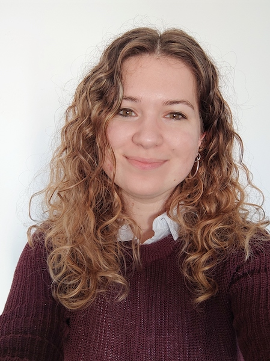
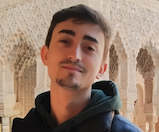

# Organization

Welcome to the organization team behind the special day of Àlex and Caterina. Just like an editorial board shapes the vision of a journal, our team is crafting an unforgettable wedding experience.

## The Team

### The Bride: Caterina

Caterina, our meticulous and detail-oriented bride, is an engineer known for her compulsive organization and precision. Her ability to plan, organize, and execute every detail with perfection brings a unique level of excellence to our wedding preparations.

### The Groom: Àlex

Àlex, the dynamic groom, also an engineer, is known for his ability to achieve great things under pressure. Often working best on the last available day, his spontaneous and resourceful approach brings a thrilling and exciting element to the wedding planning process.

### Web Technician: Josemmo

[Name], a close friend and tech wizard, is the mastermind behind this beautiful website. Their expertise in digital solutions has been invaluable in bringing our wedding into the digital age.

### Maid of Honor: Francina (Sister of the Bride)

[Name], Caterina's sister and confidante, is the maid of honor. Her unwavering support and insights have been pivotal in bringing this celebration to life. Always ready for a tequila shot when needed.

---

Together, this team is dedicated to creating a day that not only celebrates the love between Àlex and Caterina but also shares this joy with all who attend.
